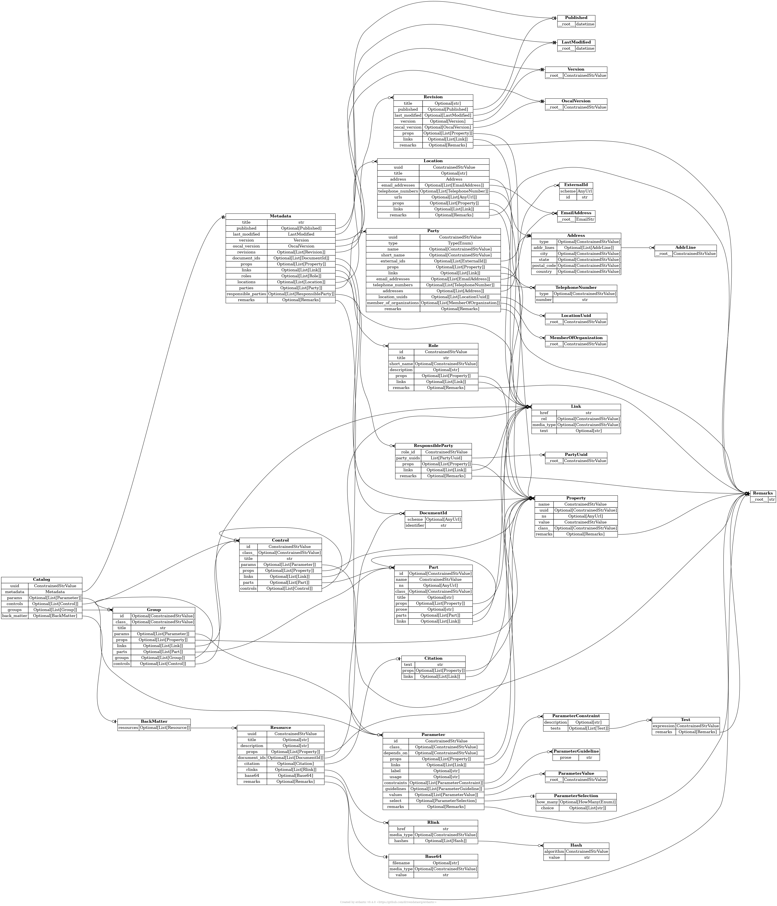

# oscal-diagrams

Automatically generated diagrams for [OSCAL](https://github.com/usnistgov/OSCAL/) models.

<center>
    
</center>

## About

This project uses [erdantic](https://github.com/drivendataorg/erdantic) to generate [OSCAL](https://github.com/usnistgov/OSCAL/) model diagrams based on [compliance-trestle](https://github.com/IBM/compliance-trestle)'s [pydantic](https://github.com/samuelcolvin/pydantic) models.

See [diagrams](diagrams) for the latest diagrams generated via GitHub Actions.

## How to Run

### Docker

Make sure you have [Docker](https://www.docker.com/) installed + running and run:

```bash
docker build -t oscal-diagrams .
docker run --rm --volume $(pwd)/diagrams:/opt/diagrams oscal-diagrams
```

This will generate the diagrams into a `diagrams` folder in the current directory.

### Locally

To generate the diagrams locally:

1. Install [Conda](https://docs.conda.io/projects/conda/en/latest/user-guide/install/)
2. Install [erdantic](https://github.com/drivendataorg/erdantic): `conda install -c drivendata erdantic`
3. Install [compliance-trestle](https://github.com/IBM/compliance-trestle): `pip install compliance-trestle`
4. Generate the diagrams: `./generate_diagrams.sh`

In case you don't want to install erdantic using conda, you can follow the [guide](https://github.com/drivendataorg/erdantic#installation) in their repository.
